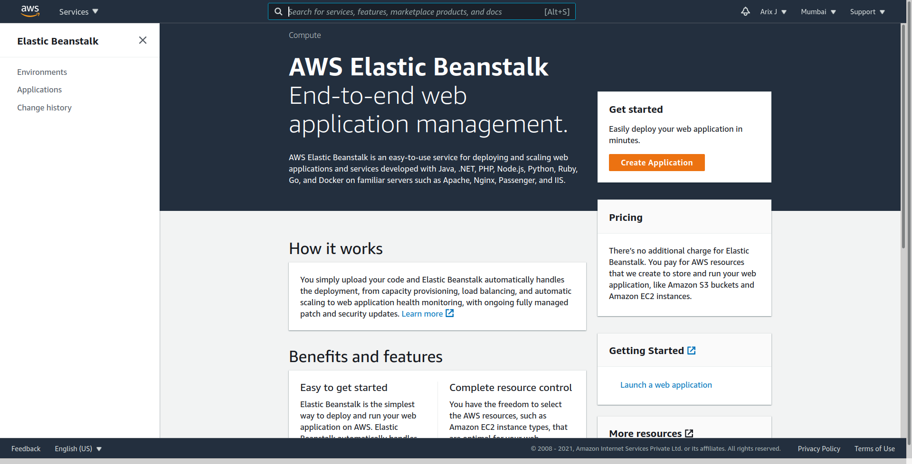
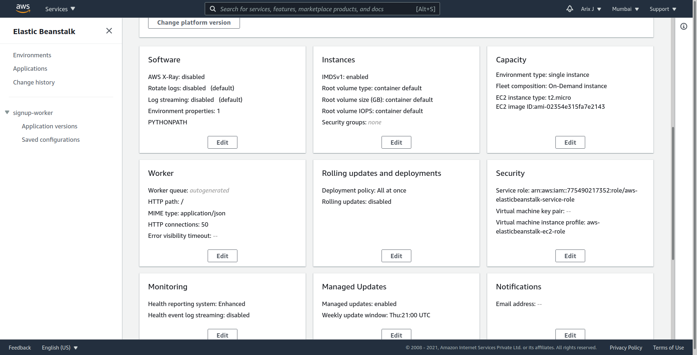
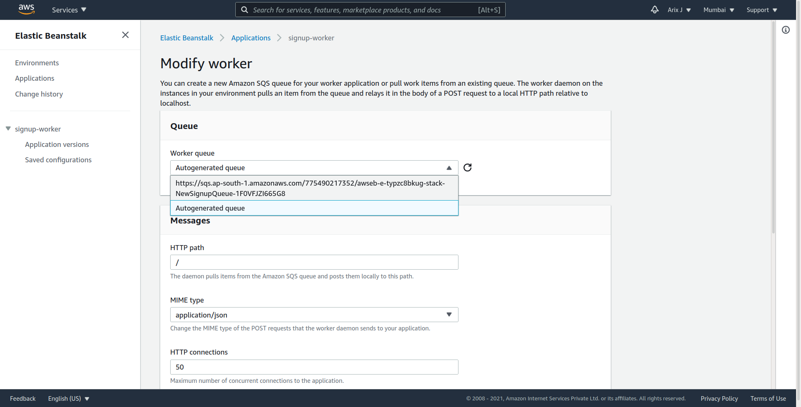
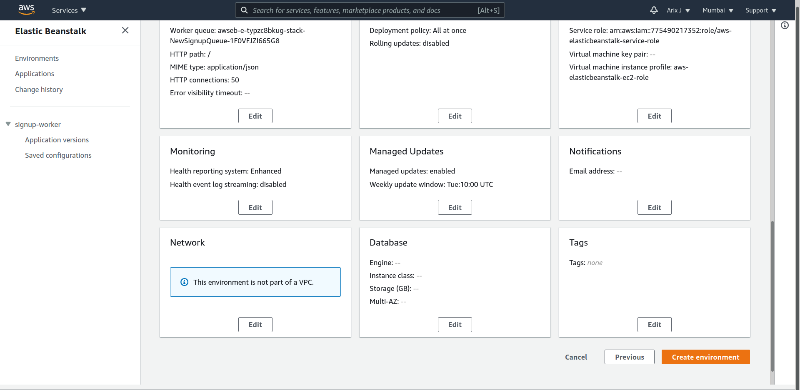
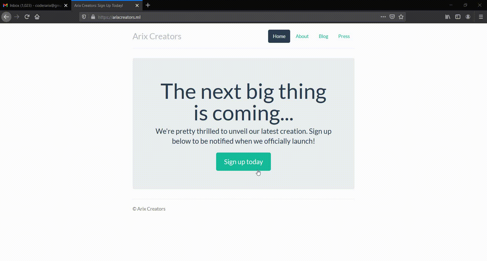

# What is AWS Elastic Bean Stalk?
* AWS Elastic Beanstalk is an easy-to-use service for deploying and scaling web applications and services.
* Services which developed with Java, .NET, PHP, Node.js, Python, Ruby, Go, and Docker on familiar servers such as Apache, Nginx, Passenger, and IIS.
* You can simply upload your code and Elastic Beanstalk automatically handles the deployment, capacity provisioning, load balancing, auto-scaling and application health monitoring. 
* At the same time, you retain full control over the AWS resources powering your application and can access the underlying resources at any time.
* There is no additional charge for Elastic Beanstalk - you pay only for the AWS resources needed to store and run your applications.

## Types of Environment tier of AWS EB:

### 1. [Web server environment tier](https://docs.aws.amazon.com/elasticbeanstalk/latest/dg/concepts-webserver.html): An application that serves HTTP requests.

  
  <!-- <h3 align="center" ><a href="https://docs.aws.amazon.com/elasticbeanstalk/latest/dg/concepts-webserver.html">Web server environment tier</a>: An application that serves HTTP requests.</h3> -->

### 2. [Worker environment tier](https://docs.aws.amazon.com/elasticbeanstalk/latest/dg/concepts-worker.html): A backend environment that pulls tasks from an Amazon SQS queue.

  

## Signup App Deployment on AWS EB
Let's get started with the AWS Elastic BeanStalk, This Repository contains two sample applications. 

###  Signup-webserver
This Python sample application uses the Flask framework and Bootstrap to build a simple, scalable customer signup form that is deployed to [AWS Elastic Beanstalk](http://aws.amazon.com/elasticbeanstalk/). The application stores data in [Amazon DynamoDB](http://aws.amazon.com/dynamodb/) and publishes notifications to the [Amazon Simple Notification Service (SNS)](http://aws.amazon.com/sns/) when a customer fills out the form.

### Signup-worker
This Python sample application illustrates the [Worker role functionality](https://docs.aws.amazon.com/elasticbeanstalk/latest/dg/using-features-managing-env-tiers.html) of AWS Elastic Beanstalk. It is designed to process messages generated by the frontend (Signup-webserver). Messages contain a customer's name and e-mail address, and the worker app uses [SNS](http://aws.amazon.com/sns/) to notify the admin when a customer fills out the form.

We use both [AWS Management Console](https://console.aws.amazon.com/console/home) and [EB CLI.](https://docs.aws.amazon.com/elasticbeanstalk/latest/dg/eb-cli3.html) Now, the question that arises is:

### What is EB CLI?
The EB CLI is a command line interface for AWS Elastic Beanstalk that provides interactive commands that simplify creating, updating and monitoring environments from a local repository. Use the EB CLI as part of your everyday development and testing cycle as an alternative to the Elastic Beanstalk console. 

## Pre-requisite
* [Install EB CLI.](https://docs.aws.amazon.com/elasticbeanstalk/latest/dg/eb-cli3-install.html#eb-cli3-install.scripts)
* Clone this Repository using the command: `git clone https://github.com/Tanuljain/eb-web-and-worker-tier.git` or download the zip file.

## Let's Jump to Hands-on, Start with EB CLI. [Signup-webserver] 
After you install the EB CLI, Go to the clone directory and change the directory to signup-webserver using the command:
`cd signup-webserver`. You are ready to configure EB CLI and your project directory by running command `eb init`. 
Follow [Configure the EB CLI.](https://docs.aws.amazon.com/elasticbeanstalk/latest/dg/eb-cli3-configuration.html)

After Configuring the EB CLI and your project directory, you are ready to create an Elastic Beanstalk environment using the EB CLI, deploy source and configuration updates, pull logs and events. 

### Eb Create
To create your first environment, run eb create and follow the prompts. If your project directory has source code in it, the EB CLI will bundle it up and deploy it to your environment. Otherwise, a sample application will be used. 

### **Note:** 
1. EB CLI configuration requires AWS Credentials, Click [Understanding and getting your AWS credentials.](https://docs.aws.amazon.com/general/latest/gr/aws-sec-cred-types.html#access-keys-and-secret-access-keys)
2. Refer [EB CLI Basics.](https://docs.aws.amazon.com/elasticbeanstalk/latest/dg/eb-cli3-getting-started.html#ebcli3-basics-create)
3. The signup-webserver directory has a file named **iam_policy.json**. Copy this policy to the attached [IAM role](https://docs.aws.amazon.com/IAM/latest/UserGuide/id_roles.html) so that the instance can access Dynamo DB and SNS Services. 

###  Signup-worker
After Successful Deployment, Move to the next application, Which is designed to process messages generated by the frontend (Signup-webserver).
Change to the signup-worker directory using the command: `cd signup-worker`. You are ready to configure your project directory. 
Run `eb init` command and follow the prompts. Then go to [Elastic Beanstalk Management Console.](https://console.aws.amazon.com/elasticbeanstalk)

#### Click **Applications** on the sidebar menu to see the applications.

#### Click on **signup-worker** application. There is no environment, Let's create a new one.
#### Click on **Create a new environment** button and select worker environment tier.

#### Choose **Python** Platform in the platform section.

#### Choose a **sample appliaction** in the application section and click on the **Configure more options** button. 

#### Click the **Edit** button in the worker section.

#### Select the queue existing queue generated by the **signup-webserver** and save.

#### **[Optional]** If you want to do SSH to the instance, click the Edit button in the security section, add a key and save.
After configuration, click the **Create environment** button.

#### The environment takes some time to do configuration. Confirm the **Subscription of SNS** on the email which you provided at the time of signup-webserver creation. Go to [SNS Console](https://ap-south-1.console.aws.amazon.com/sns/) and select the topic, Verify the email status is Confirmed under the subscription section of the topic.

## Demo

### Congratulations, Server is Ready!